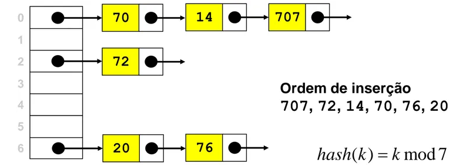

## Índice

- [Criando a classe HashTable](#criando-a-classe-hashtable)
- [Lidando com colisões](#lidando-com-colisões)
  - [Encadeamento (Separate chaining)](#encadeamento-separate-chaining)

</br>

# Criando a classe HashTable

Usaremos um _objeto_ para representar a estrutura de dados.

```javascript
import { defaultToString } from '../utils.js';

class HashTable {
  #table;
  #toStrFn;

  constructor(toStrFn = defaultToString) {
    this.#toStrFn = toStrFn;
    this.#table = {};
  }

  size() {
    return Object.keys(this.#table).length;
  }

  isEmpty() {
    return this.size() === 0;
  }

  clear() {
    this.#table = {};
  }
}
```

Também criaremos uma classe para gerar um para chave/valor, que será o valor salvo na tabela. Esta classe também terá um método toString:

```javascript
class ValuePair {
  #key;
  #value;
  constructor(key, value) {
    this.#key = key;
    this.#value = value;
  }
  toString() {
    return `[#${this.#key}: ${this.#value}]`;
  }
}
```

A seguir, precisamos implementar três métodos básicos na classe HashTable:

- `put(key, value)`: adiciona um novo item à _hash table_ (ou atualiza item existente);
- `remove(key, value)`: remove o _valor_ da tabela cuja chave é _key_;
- `get(key)`: retorna o _valor_ associado à _key_;

## Criando a função _hash_

Antes de implementar os três métodos mencionados acima, precisamos criar a função _hash_:

```javascript
#loseloseHashCode(key) {
  if (typeof key === 'number') return key;

  const tableKey = this.#toStrFn(key);
  let hash = 0;
  for (let i = 0; i < tableKey.length; i++) {
    hash += tableKey.charCodeAt(i);
  }

  return hash % 37
}

#hashCode(key) {
  return this.#loseloseHashCode(key);
}
```

No método `loseloseHashCode` verificamos se `key` é um número; caso seja, a função retorna esse número. Em seguida, é gerado um número através da soma dos valores ASCII de todas os caracteres da _key_. Por fim, a função retorna o valor _hash_. Para trabalharmos com números baixos, usamos o resto da divisão do _hash_ por um número arbitrário - isso previne trabalharmos com números muito grandes.

OBS: mais sobre a tabela ASCII [aqui](https://www.asciitable.com/)

Com a função _hash_ concluída, podemos implementar os outros métodos.

## Inserindo uma chave e um valor na _hash table_

```javascript
put(key, value) {
  if (key !== null && value !== null) {
    const position = this.#hashCode(key);
    this.#table[position] = new ValuePair(key, value);
    return true;
  }
  return false;
}
```

Primeiramente é verificado se _key_ e _value_ são válidos; caso não sejam, a função retorna `false`, indicando que o dado não foi inserido (ou atualizado) na _hash table_.

Para um par chave/valor válido, a função define uma posição na tabela usando `hashCode(key)`. É criada, então, uma instância de `ValuePair` com a _chave_ e o _valor_ e na tabela uma nova instância de `ValuePair é armazenada.

## Extraindo valor da tabela _hash_

```javascript
get(key) {
  const valuePair = this.#table[this.#hashCode(key)];
  return valuePair === null ? undefined : valuePair.value
}
```

Primeiro achamos a posição da _key_ com a função _hashCode_, então acessamos a tabela nessa posição. Por fim a função retorna o valor associado à chave.

## Removendo valores da tabela _hash_

```javascript
remove(key) {
  const hash = this.#hashCode(key);
  const valuePair = this.#table[hash];
  if (valuePair !== null) {
    delete this.#table[hash];
    return true;
  }
  return false;
}
```

Para remover um valor da _hash table_, primeiro identificamos sua posição com a função `hashCode`. Caso o _valor_ seja diferente de `null` (pois _hash tables_ não aceitam `null` como uma chave válida), deletamos esse valor com o operador `delete`. A função retornar `true` se a remoção aconteceu, ou `false` caso a remoção não tenha ocorrido.

<hr>

</br>

# Lidando com colisões

Às vezes chaves diferentes podem ter o mesmo _hash_. Chamamos essa situação **colisão** porque diferentes pares _chave/valor_ são atribuidos à mesma posição de uma _hash table_.

Suponha a seguinte situação:

```javascript
const hash = new HashTable();
hash.put('Jonathan', 'jon@email.com'); // loseloseHashCode('Jonathan') retorna 5
hash.put('Jamie', 'jamie@email.com'); // loseloseHashCode('Jamie') retorna 5
hash.put('Sue', 'sue@email.com'); // loseloseHashCode('Sue') retorna 5
```

Podemos implementar a seguinte função `toString` na classe `HashTable` para verificar como ficaria a tabela após as inserções acima.

```javascript
toString() {
  if (this.isEmpty()) return '';

  const keys = Object.keys(this.#table);
  let objString = `{${keys[0]} => ${this.#table[keys[0]].toString()}}`;

  for (let i = 1; i < keys.length; i++) {
    objString = `${objString}\n{${keys[i]} => ${this.#table[keys[i]].toString()}}`
  }

  return objString;
}
```

Após chamar `console.log(hash.toSring())` teremos o seguinte resultado:

```javascript
console.log(hash.toString());
// {5 => [#Sue: sue@email.com]}
```

`Jonathan`, `Jamie` e `Sue` receberam uma mesma _hash_, e `Sue`, por ter sido a última adição à tabela, fica sendo a ocupante da posição `5`.

Há algumas técnicas para lidar com colisões: _separate chaining_ (encadeamento), _linear probing_ (sondagem linear) e _double hashing_. Comentaremos a seguir acerca das duas primeiras.

## Encadeamento (Separate chaining)

A técnica **separate chaining** consiste em criar uma lista encadeada (_linked list_) para cada posição da tabela, armazenando elementos nessa lista. É o modo mais simples de lidar com colisões, no entanto requer consumo adicional de memória fora da instância da _hash table_.

<figure>
    
    <figcaption>Os valores foram omitidos para simplificar o diagrama</figcaption>
</figure>

Para usar as técnicas _separate chaining_ e _linear probing_ precisamos alterar três métodos: `put`, `get`, e `remove`. Esses métodos serão diferentes para cada técnica.

Começemos com a implementação da classe `HashTableSeparateChaining`:

```javascript
import ValuePair from './ValuePair.js';
import LinkedList2 from '../linked-list/LinkedList2.js';
import { defaultToString } from '../utils.js';
import HashTable from './HashTable.js';

export default class HashTableSeparateChaining extends HashTable {
  _table;

  constructor(toStrFn = defaultToString) {
    super(toStrFn);
    this._table = {};
  }
}
```

### Método `put` (separate chaining)

```javascript
put(key, value) {
  // If any 'nullish' value is passed into 'put' return 'false':
  if (
    key === undefined ||
    key === null ||
    value === undefined ||
    value === null
  )
    return false;
  // Hash the key
  const position = this._hashCode(key);
 // If there the position is empty, create a new linked list into it
  if (this._table[position] === null || this._table[position] === undefined) {
    this._table[position] = new LinkedList2();
  }
 // Insert the key/value into the linked list
  this._table[position].push(new ValuePair(key, value));
 // Return 'true' if the addition is successfull
  return true;
}
```

Verficamos se a posição em que tentaremos inserir um valor já possui outros valores. Caso seja o primeiro valor da posição, iniciamos uma instância de `LinkedList`, então adicionamos a instância de `ValuePair` à lista encadeada usando o método `insert`.

### Método `get` (separate chaining)

```javascript
get(key) {
  const position = this._hashCode(key);
  const linkedList = this._table[position];
  // If there is no such key, return 'undefined'
  if (
    linkedList === null ||
    linkedList === undefined ||
    linkedList?.isEmpty()
  ) {
    return undefined;
  }
  // Get the 'head' reference of the list
  let current = linkedList.head;
  // Find the wanted element based on the 'key'
  while (current !== null) {
    if (current.element.key === key) {
      return current.element.value;
    }
    current = current.next;
  }
}
```

Descobrimos a _hash_ da key inserida na função, então acessamos a posição _position_ na tabela, salvando o valor na variável _linkedList_.
Se _linkedList_ é `nullish` ou é uma lista vazia, o método retorna `undefined`.

Caso a lista não esteja vazia, iteramos nela até encontrar o elemento cuja propriedade _key_ seja igual ao argumento _key_ passado no método `get`.

### Método `remove` (separate chaining)

```javascript
remove(key) {
  const position = this._hashCode(key);
  const linkedList = this._table[position];
  //If there is no such key, return 'false'
  if (
    linkedList === null ||
    linkedList === undefined ||
    linkedList?.isEmpty()
  ) {
    return false;
  }
  // Get the head reference of the list:
  let current = linkedList.head;
  // Find the element to be deleted:
  while (current !== null) {
    if (current.element.key === key) {
      // When found, remove the element
      linkedList.remove(current.element);
      // If the list becomes empty, it is removed from the table
      if (linkedList.isEmpty()) {
        delete this._table[position];
      }
      // Retur 'true' to confirm the deletion
      return true;
    }
    current = current.next;
  }
}
```

Assim como no método `get`, primeiramente é verificado se há algum valor na tabela com a _key_ passada como argumento.

Caso haja uma lista na posição informada, iteramos sobre ela até encontrar o elemento cuja propriedade _key_ seja igual ao argumento passado no método `remove`. Então, o elemento encontrado é removido, usando o método `remove` da classe `LinkedList2`.

Por fim, caso a lista tenha ficado vazia após a remoção do elemento, a entrada afetada da tabela é removida, e a função retorna `true`.
